# Домашнее задание к занятию «Введение в Terraform»
Скачайте и установите Terraform версии >=1.12.0 . Приложите скриншот вывода команды terraform --version

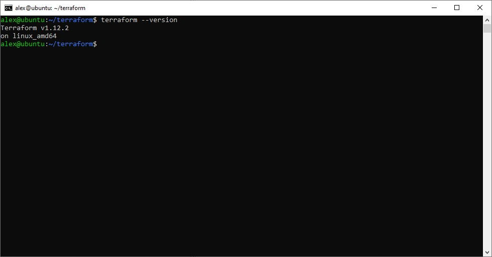

## Задача 1
1. Перейдите в каталог src. Скачайте все необходимые зависимости, использованные в проекте.
```
cp .terraformrc ~/
```
```
terrafrom init
```

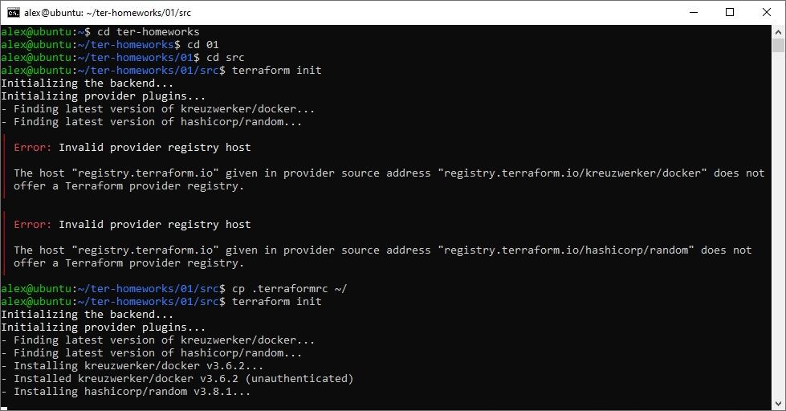

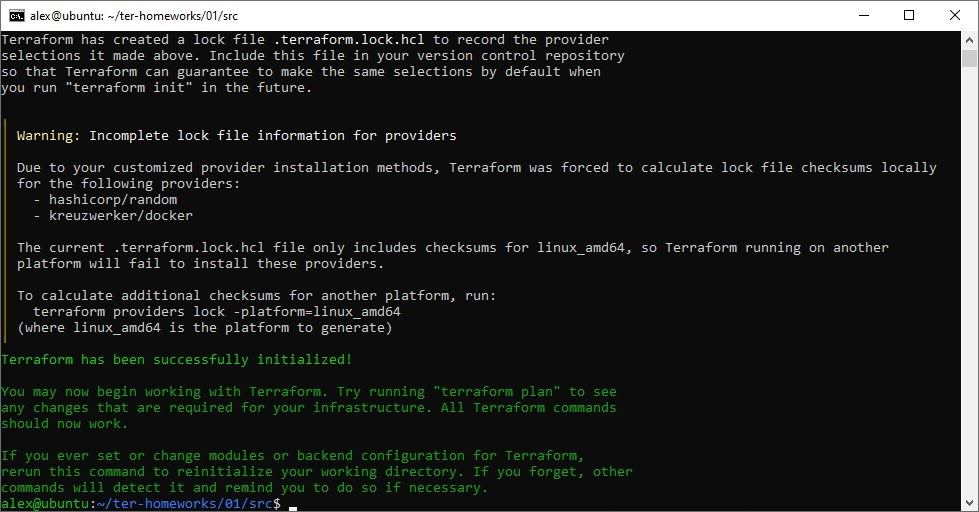

2. Изучите файл .gitignore. В каком terraform-файле, согласно этому .gitignore, допустимо сохранить личную, секретную информацию?(логины,пароли,ключи,токены итд)
```
personal.auto.tfvars
```
3. Выполните код проекта. Найдите в state-файле секретное содержимое созданного ресурса random_password, пришлите в качестве ответа конкретный ключ и его значение.
```
"result": "nDkMwN7njaqfDr4E",
```

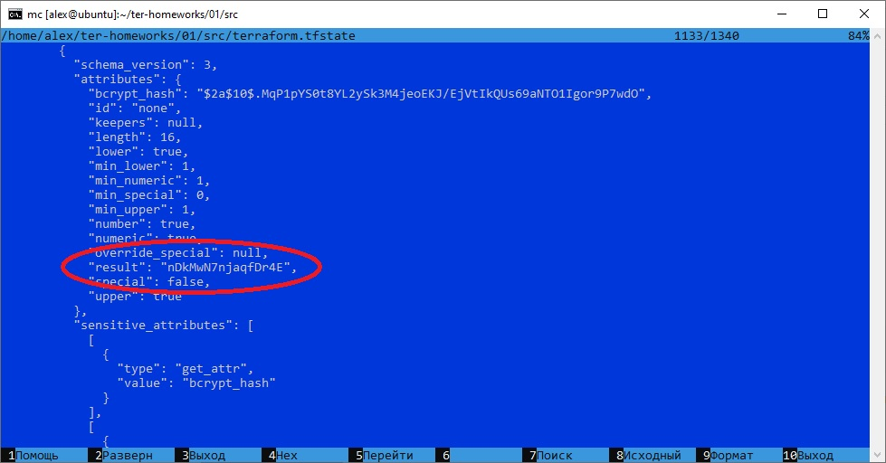

4. Раскомментируйте блок кода, примерно расположенный на строчках 29–42 файла main.tf. Выполните команду terraform validate. Объясните, в чём заключаются намеренно допущенные ошибки. Исправьте их.

Отсутствует имя для ресурса
Все блоки ресурсов должны иметь 2 метки (тип, имя).
Для docker_image надо добавить имя, например: resource "docker_image" "nginx" {

Недопустимое имя ресурса
Имя должно начинаться с буквы или подчеркивания и может содержать только буквы, цифры, подчеркивания и дефисы.
Для "docker_container" "nginx1" надо изменить имя на допустимое, например: "nginx".

random_string_FAKE — неверное имя ресурса (есть только random_string)
resulT — опечатка, должно быть result
Исправление: name  = "example_${random_password.random_string.result}"

5. Выполните код. В качестве ответа приложите: исправленный фрагмент кода и вывод команды docker ps

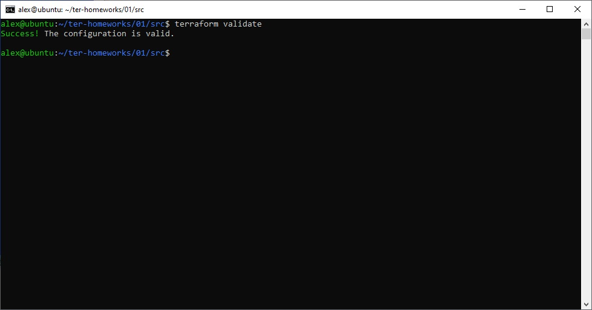

```
terrafrom apply
```

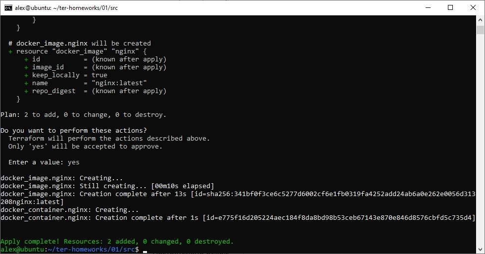

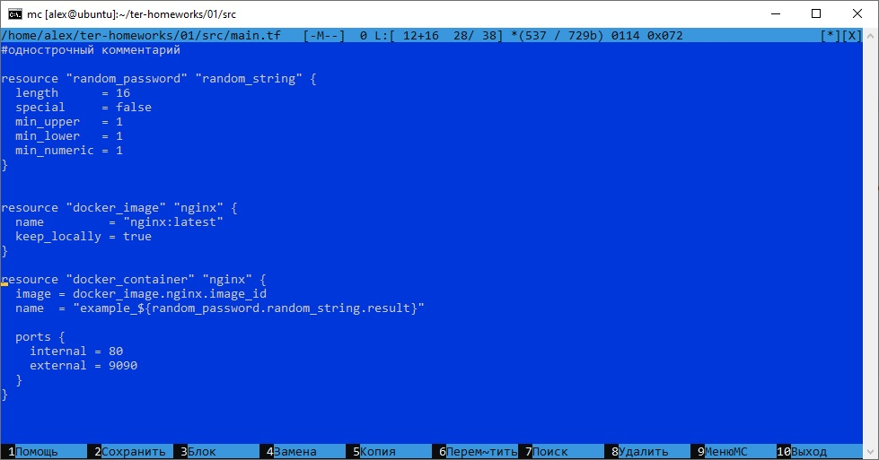

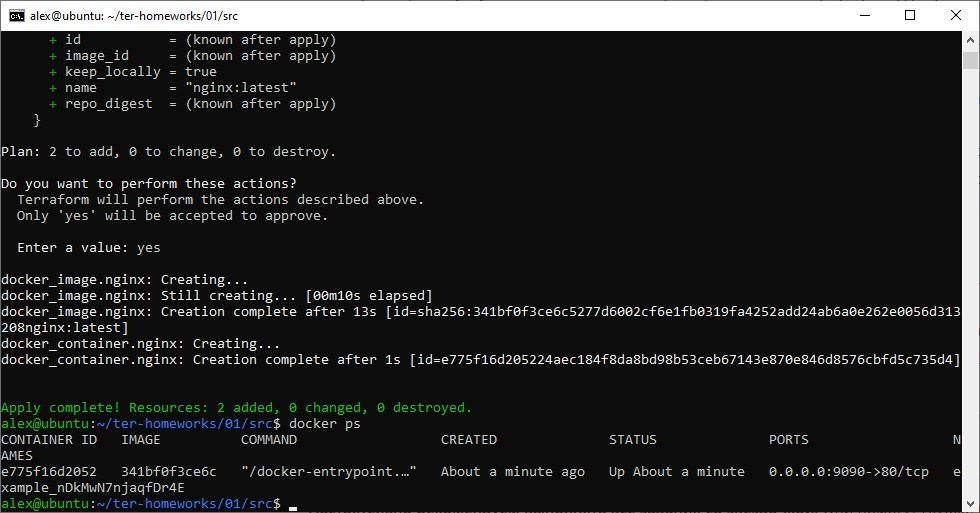

6. Замените имя docker-контейнера в блоке кода на hello_world. Не перепутайте имя контейнера и имя образа. Мы всё ещё продолжаем использовать name = "nginx:latest". Выполните команду terraform apply -auto-approve. Объясните своими словами, в чём может быть опасность применения ключа -auto-approve. Догадайтесь или нагуглите зачем может пригодиться данный ключ? В качестве ответа дополнительно приложите вывод команды docker ps


Команда terraform apply -auto-approve автоматически применяет изменения в инфраструктуре без запроса подтверждения.

Опасность ключа -auto-approve
Этот флаг обходит обязательный шаг ручного подтверждения плана изменений, показанного Terraform перед применением. В результате можно случайно уничтожить ресурсы (например, удалить базу данных), внести нежелательные модификации или потерять данные из-за ошибок в конфигурации, не успев их заметить. Особенно рискованно в production-средах, где изменения влияют на реальную инфраструктуру.

Зачем нужен ключ:
Он упрощает автоматизацию: идеален для CI/CD-пайплайнов, скриптов и неинтерактивных окружений (dev/test), где ручное подтверждение замедляет процесс.

7. Уничтожьте созданные ресурсы с помощью terraform. Убедитесь, что все ресурсы удалены. Приложите содержимое файла terraform.tfstate.
```
terraform destroy
```
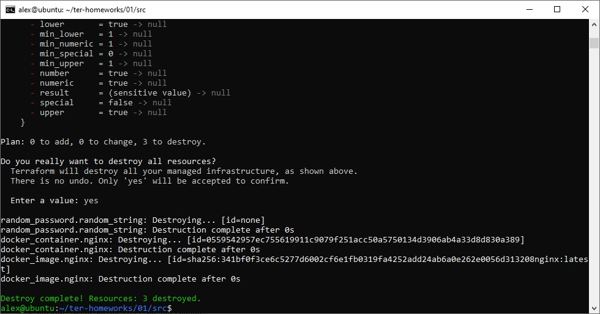

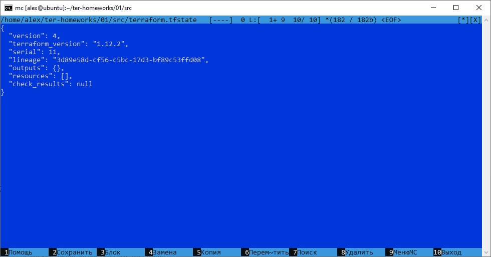

8. Объясните, почему при этом не был удалён docker-образ nginx:latest. Ответ ОБЯЗАТЕЛЬНО НАЙДИТЕ В ПРЕДОСТАВЛЕННОМ КОДЕ, а затем ОБЯЗАТЕЛЬНО ПОДКРЕПИТЕ строчкой из документации terraform провайдера docker. (ищите в классификаторе resource docker_image )

Образ не удален из локального хранилища Docker при операции destroy, т.к. keep_locall = true. 
Следует из документации:
https://library.tf/providers/kreuzwerker/docker/latest/docs/resources/image
keep_locally (Boolean) If true, then the Docker image won't be deleted on destroy operation. If this is false, it will delete the image from the docker local storage on destroy operation.

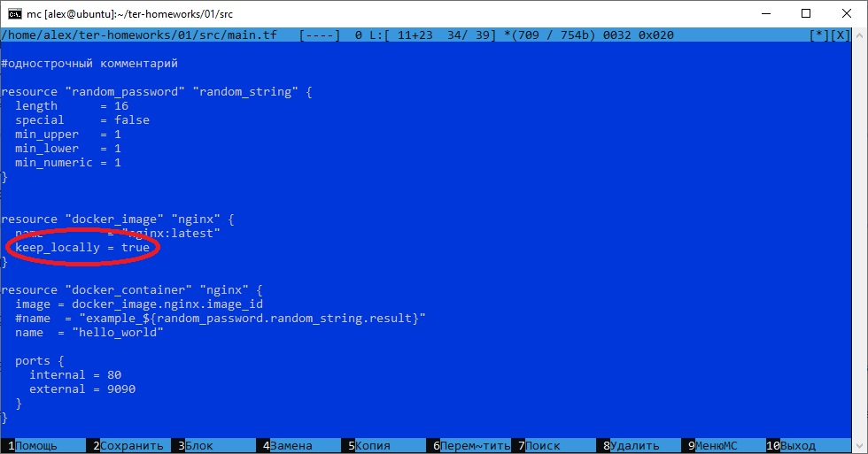


